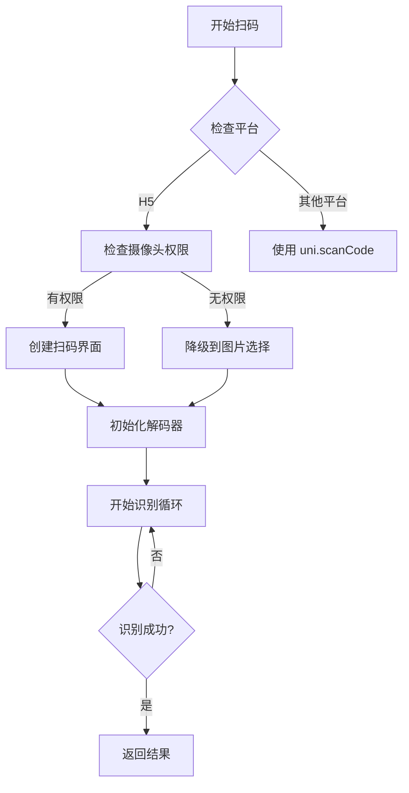

# jz-h5-scanCode

## 🔍 插件简介

jz-h5-scanCode 是一个专为 H5 环境设计的二维码扫描插件，提供与 `uni.scanCode` 完全兼容的 API 接口。插件采用模块化架构，支持多种识别引擎，提供微信风格的扫码界面。

## ✨ 核心特性

### 🎯 API 兼容性
- 与 `uni.scanCode` API 完全兼容
- 支持相同的参数配置和回调函数
- 平台自动判断，H5 使用自定义实现，其他平台使用原生 API

### 📱 用户界面
- **微信风格设计**：仿微信扫码界面，用户体验一致
- **全屏沉浸式**：黑色背景，突出扫码区域
- **动态扫描线**：绿色扫描线上下移动，提供视觉反馈
- **自定义配置**：支持 8 种扫描框颜色选择

### 🔧 技术架构
- **模块化设计**：核心功能分离，便于维护和扩展
- **多重识别引擎**：BarcodeDetector API + jsQR 库双重保障
- **智能降级**：摄像头不可用时自动切换到图片选择模式
- **图像预处理**：多种算法提高二维码识别成功率

## 📦 安装使用

### 1. uni-app 项目中使用

```javascript
// 导入插件
import jzH5ScanCode from '@/uni_modules/jz-h5-scanCode/js/index.js'

// 基础扫码
jzH5ScanCode.scanCode({
    success: (res) => {
        console.log('扫码成功:', res.result)
    },
    fail: (res) => {
        console.log('扫码失败:', res.errMsg)
    }
})
```

### 2. 普通 H5 项目中使用

```javascript
// ES6 模块导入
import jzH5ScanCode from './uni_modules/jz-h5-scanCode/js/index.js'

// 或者直接引入
<script type="module">
    import jzH5ScanCode from './uni_modules/jz-h5-scanCode/js/index.js'
    // 使用插件
</script>
```

## 🔧 API 文档

### scanCode(options)

主要扫码方法，与 uni.scanCode API 完全兼容。

#### 参数说明

| 参数名 | 类型 | 必填 | 默认值 | 说明 |
|--------|------|------|--------|------|
| success | Function | 否 | - | 扫码成功回调函数 |
| fail | Function | 否 | - | 扫码失败回调函数 |
| complete | Function | 否 | - | 扫码完成回调函数 |
| scanType | Array | 否 | ['qrCode'] | 扫码类型，目前仅支持二维码 |
| onlyFromCamera | Boolean | 否 | false | 是否仅允许从相机扫码 |
| scanFrameColor | String | 否 | '#00ff00' | 扫描框颜色 |

#### 回调参数

**success 回调参数：**

| 参数名 | 类型 | 说明 |
|--------|------|------|
| result | String | 扫码内容 |
| scanType | String | 扫码类型 |
| charSet | String | 字符集 |
| imageChannel | String | 图像来源（camera/album） |
| errMsg | String | 错误信息 |

**fail 回调参数：**

| 参数名 | 类型 | 说明 |
|--------|------|------|
| errMsg | String | 错误信息 |

#### 使用示例

```javascript
// 基础扫码
jzH5ScanCode.scanCode({
    success: (res) => {
        console.log('扫码结果:', res.result)
        console.log('扫码类型:', res.scanType)
        console.log('图像来源:', res.imageChannel)
    },
    fail: (res) => {
        console.log('扫码失败:', res.errMsg)
    },
    complete: () => {
        console.log('扫码完成')
    }
})

// 高级配置
jzH5ScanCode.scanCode({
    scanType: ['qrCode'],
    onlyFromCamera: true,
    scanFrameColor: '#007aff',
    success: (res) => {
        // 处理扫码结果
    }
})
```

### 静态方法

#### isCameraSupported()

检查设备是否支持摄像头。

```javascript
const supported = await jzH5ScanCode.isCameraSupported()
console.log('摄像头支持:', supported)
```

#### isBarcodeDetectorSupported()

检查浏览器是否支持 BarcodeDetector API。

```javascript
const supported = jzH5ScanCode.isBarcodeDetectorSupported()
console.log('BarcodeDetector 支持:', supported)
```

#### getSupportedFormats()

获取支持的条码格式。

```javascript
const formats = await jzH5ScanCode.getSupportedFormats()
console.log('支持的格式:', formats)
```

#### getPluginInfo()

获取插件信息。

```javascript
const info = jzH5ScanCode.getPluginInfo()
console.log('插件信息:', info)
```

## 🎨 界面配置

### 扫描框颜色

插件支持 8 种预设颜色：

- `#00ff00` - 绿色（默认）
- `#007aff` - 蓝色
- `#ff3b30` - 红色
- `#ff9500` - 橙色
- `#ffcc00` - 黄色
- `#34c759` - 青绿色
- `#af52de` - 紫色
- `#ffffff` - 白色

```javascript
jzH5ScanCode.scanCode({
    scanFrameColor: '#007aff', // 蓝色扫描框
    success: (res) => {
        // 处理结果
    }
})
```

## 🏗️ 技术架构

### 核心模块

#### 1. index.js - 主入口
- API 兼容性处理
- 平台判断逻辑
- 事件管理和协调

#### 2. cameraScanner.js - 摄像头管理
- 摄像头权限申请
- 视频流获取和管理
- 图像数据提取

#### 3. qrCodeDecoder.js - 二维码解码
- BarcodeDetector API 集成
- jsQR 库集成
- 图像预处理算法
- 多重识别策略

#### 4. uiManager.js - 界面管理
- 微信风格 UI 创建
- 扫描动画效果
- 用户交互处理
- 响应式布局

#### 5. utils.js - 工具函数
- 调试日志管理
- 错误处理
- 通用工具方法

### 识别流程



## 🔍 识别引擎

### 1. BarcodeDetector API
- **优先级**：最高
- **支持浏览器**：Chrome 83+, Edge 83+
- **特点**：原生实现，性能最佳

### 2. jsQR 库
- **优先级**：备用
- **支持浏览器**：所有现代浏览器
- **特点**：纯 JavaScript 实现，兼容性好

### 3. 图像预处理
- **灰度转换**：提高识别速度
- **对比度增强**：改善图像质量
- **二值化处理**：突出二维码特征
- **图像缩放**：适配不同尺寸
- **图像旋转**：处理倾斜的二维码

## 📱 浏览器兼容性

| 功能 | Chrome | Firefox | Safari | Edge | 移动端 |
|------|--------|---------|--------|------|--------|
| 摄像头扫码 | ✅ 60+ | ✅ 55+ | ✅ 11+ | ✅ 79+ | ✅ |
| 图片扫码 | ✅ | ✅ | ✅ | ✅ | ✅ |
| BarcodeDetector | ✅ 83+ | ❌ | ❌ | ✅ 83+ | 部分 |
| jsQR 识别 | ✅ | ✅ | ✅ | ✅ | ✅ |

## 🛠️ 开发指南

### 本地开发

1. **环境要求**
   - 现代浏览器
   - HTTPS 或 localhost 环境
   - HTTP 服务器（不能直接打开 HTML 文件）

2. **调试模式**
   ```javascript
   // 开启调试日志
   console.log('调试模式已开启')
   ```

3. **常见问题**
   - **摄像头权限**：确保使用 HTTPS 或 localhost
   - **识别失败**：检查二维码清晰度和光线条件
   - **界面异常**：检查 CSS 样式冲突

### 自定义扩展

```javascript
// 扩展识别引擎
import { QRCodeDecoder } from './qrCodeDecoder.js'

class CustomDecoder extends QRCodeDecoder {
    // 自定义识别逻辑
}

// 扩展 UI 样式
import { UIManager } from './uiManager.js'

class CustomUIManager extends UIManager {
    // 自定义界面
}
```

## 📊 性能优化

### 识别性能
- **多重引擎**：BarcodeDetector + jsQR 双重保障
- **图像预处理**：多种算法提高识别率
- **智能采样**：减少不必要的计算

### 内存管理
- **及时清理**：自动释放摄像头资源
- **事件解绑**：防止内存泄漏
- **DOM 清理**：完全移除 UI 元素

### 用户体验
- **快速响应**：扫码成功立即返回
- **流畅动画**：60fps 扫描线动画
- **错误提示**：友好的错误信息

## 🔧 故障排除

### 常见问题

1. **摄像头无法启动**
   - 检查是否使用 HTTPS 协议
   - 确认浏览器摄像头权限
   - 尝试刷新页面重新授权

2. **二维码识别失败**
   - 确保二维码清晰可见
   - 调整光线条件
   - 尝试不同角度和距离

3. **界面显示异常**
   - 检查 CSS 样式冲突
   - 确认 z-index 设置
   - 验证 DOM 结构完整性

### 调试信息

```javascript
// 获取详细的调试信息
const info = jzH5ScanCode.getPluginInfo()
console.log('插件版本:', info.version)
console.log('浏览器支持:', info.cameraSupported)
console.log('识别引擎:', info.barcodeDetectorSupported)
```

## 📄 许可证

MIT License - 详见 [LICENSE](../../LICENSE) 文件

## 🤝 贡献

欢迎提交 Issue 和 Pull Request！

## 📞 支持

如有问题，请通过以下方式联系：

- 提交 Issue
- 邮箱：[your-email@example.com]
- 文档：查看项目 README

---

**版本**: 1.0.0  
**更新时间**: 2024年  
**作者**: JZ
